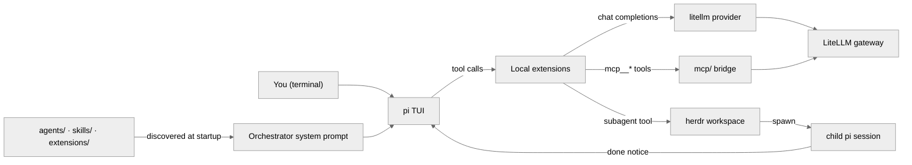

<h1 align="center">
  .pi ⚙️
</h1>
<p align="center">
  A <strong>dotfiles repository</strong> that <em>collapses a personal pi setup — extensions, subagents, skills, and provider wiring — into one clone</em>.
</p>

<br>
<br>

## What is .pi?

This repo is my `.pi` configuration — the home directory of the [pi](https://www.npmjs.com/package/@earendil-works/pi-coding-agent) coding agent, published the way others publish a dotfiles repo. It lives at `~/.pi`, the directory pi reads for its agent configuration.

It owns everything I tune: local TypeScript extensions that pi auto-loads at startup, a fleet of eight subagent definitions, a library of 38 skills, prompt templates, the tokyo-night TUI theme, the default model/provider settings, the LiteLLM provider wiring, and the MCP gateway config. Everything a pi session *generates* — session transcripts, caches, vendored package checkouts, run directories — is gitignored, per the rule written into [.gitignore](.gitignore): if deleting it costs nothing but a re-run, it is ignored.

## Why use .pi?

By default, pi's agent directory mixes configuration with machine state: your extensions, subagents, and skills live beside session transcripts and package caches, and none of it travels. Rebuilding that setup on a new machine means re-registering extensions, re-adding agent definitions, re-wiring the provider, and re-typing gateway keys.

This repo makes the whole setup versioned and portable — clone it, point `~/.pi` at it, drop in a `.env`, and your full personal agent is running. The conventions in [AGENTS.md](AGENTS.md) (parse errors are startup-fatal, one parser per format, widgets must measure, secrets live in exactly one file) keep that configuration safe as it grows.

## Features 🚀

- 🧩 **Local extensions, auto-loaded:** every top-level `agent/extensions/*.ts` ships into every session — a `questionnaire` tool that asks you multiple-choice questions in the TUI, a `/sessions` browser for resuming past work, a `/diff` widget for session changes, a dynamic system prompt built from your discovered inventory, and an update check that runs at most every 4 hours.
- 🤖 **A subagent fleet you can delegate to:** eight specialized definitions (explorer, librarian, oracle, planner, reviewer, spiker, verifier, worker), each with its own model, fallback chain, and tool allowlist — read-only by construction where a verdict needs to be independent.
- 🃏 **A skills library with progressive disclosure:** 38 skills, each a `SKILL.md` entry point plus reference docs loaded on demand; 15 are slash-only, so interview and workflow skills never fire mid-task without you.
- 🔁 **Completion loops with verification gates:** `/ralph-loop <goal>` re-prompts the agent until it signs off with a completion tag, and `--verify` can audit that claim with a read-only oracle pass and a Dockerized runtime pass before accepting it.
- 🧑‍🤝‍🧑 **Event-driven delegation:** the `subagent` tool spawns each child in its own herdr tab and ends the turn — the child wakes the parent with a notice when it reports, so you can message a running child mid-flight.
- 🌐 **MCP wired through placeholders:** [agent/mcp.json](agent/mcp.json) registers the LiteLLM MCP gateway with `${VAR}` fields, and `/mcp status|list|refresh` inspects and reconnects servers from the TUI.
- 🔐 **One file for secrets:** `agent/.env` is the only place live credentials exist, and it is gitignored; the provider and the MCP config read it through named placeholders.
- 📦 **Self-repairing dependencies:** [scripts/setup-deps.sh](scripts/setup-deps.sh) runs at pi startup and on every checkout/merge, so a fresh clone loads its extensions without a manual `npm install`.

## How to Install ⚡

### Prerequisites 📦

- [bun](https://bun.sh) — the runtime that installs and runs pi
- [pi](https://www.npmjs.com/package/@earendil-works/pi-coding-agent) — install with `bun install -g @earendil-works/pi-coding-agent`
- [git](https://git-scm.com)
- [Node.js](https://nodejs.org) with npm — for the one extension with real npm dependencies (`agent/extensions/mcp/`)
- [Docker](https://docs.docker.com) — optional; only the ralph-loop `--verify` runtime gate needs it

### Steps

1. Clone the repository into `~/.pi` — the directory pi resolves its agent tree from:

   ```sh
   git clone https://github.com/jwmarb/dotpi.git ~/.pi
   ```

2. If you would rather keep the clone elsewhere, point `~/.pi` at it instead:

   ```sh
   ln -s /path/to/dotpi ~/.pi
   ```

3. Create the credential file and fill in the four `LITELLM_*` values:

   ```sh
   cp agent/.env.example agent/.env
   ```

4. Install the extension dependencies:

   ```sh
   bash scripts/setup-deps.sh
   ```

5. Start pi:

   ```sh
   pi
   ```

   pi self-arms the git hooks (`core.hooksPath → .githooks`) and re-runs the dependency install at startup, so a working checkout keeps itself working across branches.

### Environment Variables 🔧

All four live in `agent/.env` (template: [agent/.env.example](agent/.env.example)):

| Variable            | Required | Default | Description                                                                                                                          |
| ------------------- | -------- | ------- | ------------------------------------------------------------------------------------------------------------------------------------- |
| `LITELLM_API_KEY`   | yes      | —       | Provider key used by `agent/extensions/litellm.ts` (`Authorization: Bearer <key>`)                                                     |
| `LITELLM_BASE_URL`  | yes      | —       | Provider base URL used by `agent/extensions/litellm.ts`                                                                               |
| `LITELLM_MCP_KEY`   | yes      | —       | Gateway key sent by `agent/mcp.json` as the `x-litellm-api-key` header — a **different** credential from `LITELLM_API_KEY`            |
| `LITELLM_MCP_URL`   | yes      | —       | Gateway base URL used by `agent/mcp.json`                                                                                              |

## Repository Layout 📁

| Path                              | What it is                                                                             |
| --------------------------------- | -------------------------------------------------------------------------------------- |
| `agent/extensions/`               | Local pi extensions; every top-level `*.ts` is auto-loaded at startup (inventory: [`agent/extensions/AGENTS.md`](agent/extensions/AGENTS.md)) |
| `agent/agents/`                   | Subagent definitions — Markdown + YAML frontmatter                                     |
| `agent/skills/`                   | Skills library, one directory per skill (`SKILL.md` + reference docs)                   |
| `agent/prompts/`                  | Prompt templates (`git-commit.md`: Conventional Commits)                                |
| `agent/themes/`                   | TUI theme (`tokyo-night.json`)                                                         |
| `agent/settings.json`             | pi config: default provider/model/thinking level, retry policy, installed packages      |
| `agent/mcp.json`                  | MCP servers — placeholders only; keys come from `agent/.env`                            |
| `agent/.env`                      | The only file with live credentials (gitignored; template is `agent/.env.example`)      |
| `agent/docker/`                   | Tracked reference image for runtime verification                                       |
| `.githooks/`                      | Tracked `pre-commit`, `post-checkout`, `post-merge` hooks                              |
| `scripts/setup-deps.sh`           | Installs each extension's npm dependencies                                             |
| `agent/sessions/`, `agent/subagent-runs/`, `agent/npm/`, `agent/git/`, … | Machine state — all gitignored                                   |

## Extensions 🧩

| Extension          | Registers / owns                                                                                          |
| ------------------ | --------------------------------------------------------------------------------------------------------- |
| `ask-user.ts`      | `questionnaire` tool — TUI option list + free-text fallback, one question at a time                        |
| `changed-files.ts` | `/changed-files`, `/diff` — session change widget with +/− counts                                          |
| `display-file.ts`  | `display_file` tool — opens a file in the platform's default app                                          |
| `dynamic-prompt.ts`| Replaces pi's default system prompt with one built from your discovered agents, tools, skills, and context |
| `git-hooks.ts`     | Self-arms `core.hooksPath` and runs the dependency install at startup                                     |
| `init.ts`          | `/init` — regenerates the per-directory `AGENTS.md` knowledge base                                        |
| `litellm.ts`       | `registerProvider("litellm")` — model catalog, per-token costs, thinking-level maps                       |
| `sessions.ts`      | `/sessions` — resumable session list from pi's own session manager                                        |
| `thinking-indicator.ts` | Live thinking spinner + transcript label for the collapsed thinking block                          |
| `auto-update/`     | `/update` + `pi_update` tool — version check on session start, at most every 4 hours                       |
| `mcp/`             | `/mcp status\|list\|refresh` — registers each MCP tool as `mcp__<server>__<tool>`                          |
| `ralph-loop/`      | `/ralph-loop`, `/ulw-loop`, `/loop-stop` — completion loop with `--verify` gates                           |
| `subagent-herdr/`  | `subagent` / `subagent_tasks` tools — event-driven delegation into herdr tabs                              |
| `lib/`             | Shared pi-free helpers: the `.env` parser, the layout resolver, the agent parser, widget measuring         |

## Subagents 🤖

| Agent       | Role                                                          | Model             |
| ----------- | ------------------------------------------------------------- | ----------------- |
| `explorer`  | Read-only codebase recon; returns a compressed map with `file:line` references | deepseek-v4-flash |
| `librarian` | Read-only external research; looks up library/API docs via the MCP gateway    | deepseek-v4-flash |
| `oracle`    | High-stakes architecture consultation; last-resort debugging             | gpt-5.6-sol       |
| `planner`   | Read-only implementation planning; ordered, file-specific steps          | gpt-5.6-sol       |
| `reviewer`  | Read-only code review; findings reported by severity                   | claude-opus-5     |
| `spiker`    | Proves an API's real behavior with a throwaway spike                     | qwen3.8-27b       |
| `verifier`  | Runs the project's tests/build in Docker; reports pass/fail              | claude-opus-5     |
| `worker`    | Implements a single well-specified change end to end                   | qwen3.8-27b       |

Every agent declares `fallback_models`, tried when a child fails to *launch* (unknown model, provider down, rate-limited) — not when it fails its task. Read-only agents carry no `write`/`edit`: the `tools` list is the enforcement.

## Skills 🃏

38 skill directories under [`agent/skills/`](agent/skills/). Each skill is a `SKILL.md` entry point with sibling docs (`tests.md`, `REPORT.md`, `PATTERNS.md`, …) loaded on demand — progressive disclosure. 15 skills set `disable-model-invocation: true`: interview and workflow skills that need a human in the loop fire only from a slash command. Personal-identity skills are kept on disk and gitignored rather than placeholdered.

## Commands ⌨️

```sh
pi /update                                         # check for + install a pi update
pi /mcp status | list [server] | refresh [server]  # MCP server health and tool registration
pi /reload                                         # hot-reload extensions after editing them
pi /sessions                                       # list/resume previous sessions
pi /diff                                           # review changed files (+/− counts)
pi /init                                           # regenerate the AGENTS.md knowledge base
pi /ralph-loop <goal> [--verify[=static|runtime|both]] [--max-iterations=N]
pi /ulw-loop <goal>                                # same loop, plus the ultrawork intensity directive
pi /loop-stop                                      # stop the running loop
```

## Architecture 🏗️



Notice that everything pi loads at startup — the prompt it writes, the tools it offers, the providers it calls — resolves to a file in this repo; the only traffic that leaves the machine is the gateway connection.

## Testing 🧪

Unit tests are run **by explicit path** — a bare `bun test` sweeps in the vendored suites under `agent/git/` and `agent/npm/` (~437 test files) and reports hundreds of failures unrelated to this repo:

```sh
bun test agent/extensions/lib/                       # widget/agents/layout/sessions (59)
bun test agent/extensions/subagent-herdr/lib.test.ts # herdr (49)
bun test agent/extensions/ralph-loop/lib.test.ts     # ralph-loop (135)
```

Typecheck has two scopes (there is no root `tsconfig.json`):

```sh
cd agent/extensions/mcp && ./node_modules/.bin/tsc -p tsconfig.json
cd agent/extensions/subagent-herdr && ../mcp/node_modules/.bin/tsc -p tsconfig.json
```

## Conventions 📏

- **Parse errors are startup-fatal.** Pi auto-loads every top-level `agent/extensions/*.ts`; a test file placed there breaks pi startup. Tests live in subdirectories.
- **One parser per format.** `lib/dotenv.ts` owns `agent/.env`, `lib/agents.ts` owns the `agents/*.md` frontmatter, `subagent-herdr/rundir.ts` owns the run-directory shapes and the wake-notice grammar. Two parsers drift, and drift is how credentials and spawn arguments get out of sync.
- **Widgets must measure.** Hand-built widget lines render through `fitLines`/`fittedWidget` (`lib/widget.ts`): a line wider than the terminal throws in pi's TUI host and kills the process.
- **Secrets live only in `agent/.env`.** `mcp.json` uses `${LITELLM_MCP_KEY}` placeholders and `litellm.ts` reads `LITELLM_API_KEY` lazily; a literal key in a tracked file defeats both.
- **Commits follow Conventional Commits** per [`agent/prompts/git-commit.md`](agent/prompts/git-commit.md).

## OS Compatibility

Linux and macOS — the setup scripts are bash, the `~/.pi` pointer is a symlink, and the `--verify` runtime gate needs a Docker daemon. The configuration itself is plain JSON/TypeScript/Markdown and platform-agnostic.

## Known Limitations ⚠️

- **The pre-commit hook is dormant.** `.githooks/pre-commit` invokes a `scripts/check.sh` that was removed; the hook then silently exits 0. Nothing currently enforces "extension sources must load" at commit time — `/reload` after editing is the only guard.
- **Test/host version skew.** `bun test` resolves the packages pi normally injects by walking up to `~/node_modules`, which lags the running pi (0.75.4 vs 0.85.1 today). A test that passes here can still disagree with the live host.
- **Runtime verification needs Docker.** Without a working daemon the `--verify` gate returns `inconclusive` and the loop stops rather than assuming success — "I could not run it" never reads as "it works".
- **Top-level extensions are in no typecheck scope.** `lib/` and every top-level `*.ts` are covered only by pi loading them; the two `tsc -p` scopes reach `mcp/` and `subagent-herdr/` alone.

## Credits 🙏

- The `/ralph-loop` and `/ulw-loop` completion loops are ports of [oh-my-openagent](https://github.com/code-yeongyu/oh-my-openagent)'s commands of the same name; `/init`'s tiering borrows from its `init-deep` scoring matrix.
- Most of the skills in `agent/skills/` come from [Matt Pocock's skills](https://github.com/mattpocock/skills).

---

Created with ❤️ by Joseph Marbella
