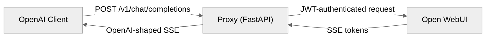
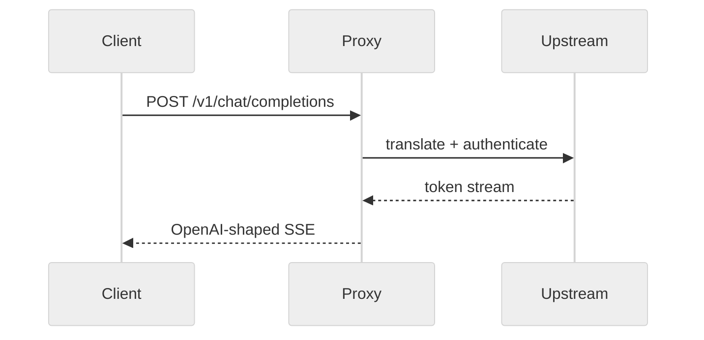
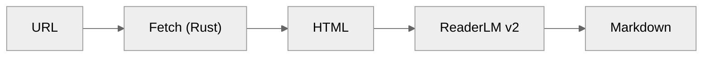
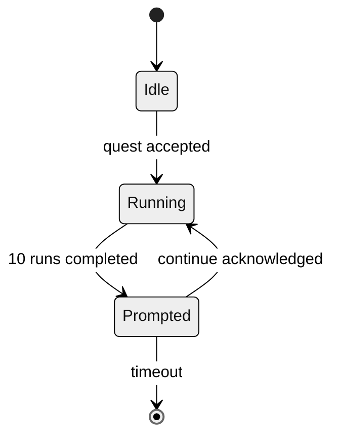
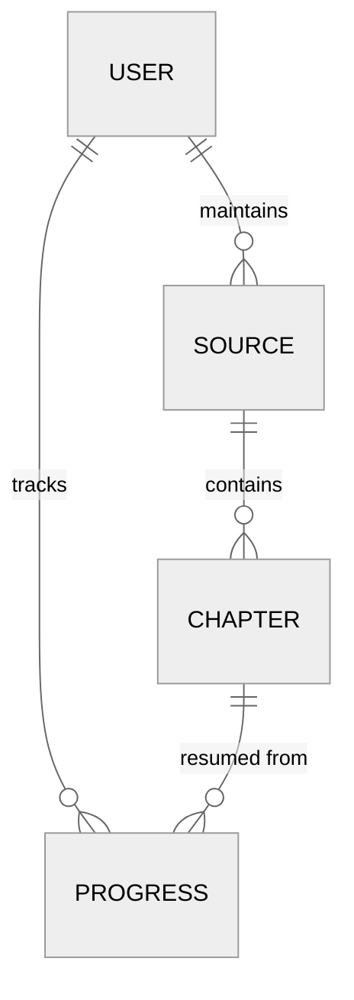

# Mermaid Diagrams

GitHub renders ```mermaid fences natively, so the diagram lives in the README as text and travels with it. Use one where the shape of the system carries more than the prose can: architecture with more than two boxes, a request crossing services, a pipeline with stages, a state machine, a data model with real relationships.

Skip the diagram when a single sentence already says it, or when the only thing to show is a UI — that is a screenshot in the header strip.

## House conventions

- Tag the fence with `mermaid` and put nothing else in the block.
- Open with `%%{init: {"theme":"neutral"}}%%` so the diagram sits quietly on both GitHub light and dark themes.
- Label an arrow with *what moves* — a payload, a call, a state change — not "then".
- Name every node by what it is to the *user* of the system (`OpenAI Client`, `Proxy (FastAPI)`, `Open WebUI`), and keep node ids short and stable.
- Keep it under ~15 nodes. Beyond that, split into two diagrams under sub-headings.
- Follow the diagram with one sentence of orientation — what the reader should notice — never a restatement of the boxes.
- Write the `## Architecture 🏗️` heading from the vocabulary in `SKILL.md` above it.

## Recipes

**Architecture / request flow** — services as nodes, arrow labels as the call and its payload:



**Sequence** — when the *order* of exchanges is the point (handshakes, auth, streaming):



**Pipeline** — stages data passes through, with the artifact on each edge:



**State machine** — the lifecycle of a persisted object:



**Data model** — entities and their real relationships:



## Checking a diagram

Mermaid fails silently on GitHub — a bad diagram collapses into a code block, so a syntax error ships as raw text. Parse every block before finishing:

```sh
cd ~/.agents/skills/readme && npm i mermaid jsdom dompurify
node check_mermaid.mjs /path/to/README.md
```

`check_mermaid.mjs` runs mermaid's parser without a browser, so it works in a headless sandbox where the rendering CLI cannot launch. It prints `PASS` / `FAIL` per block and exits non-zero on any failure. A `FAIL` names the line — fix that line rather than simplifying the diagram into something that says less.

When a browser *is* available, render to confirm layout as well as syntax:

```sh
npx -y @mermaid-js/mermaid-cli -i arch.mmd -o /tmp/arch.svg
```

Either way, keep the orientation sentence in the README next to the diagram: a reader who sees only a broken code block should still come away with the architecture.
